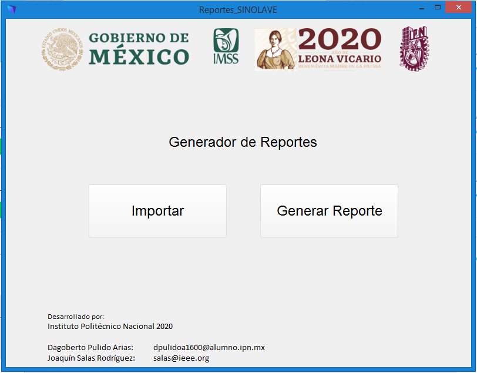

# Generador de Reporte SINOLAVE
Generador de reportes de SINOLAVE

 
*Fig. 1: Pantalla de Inicio del Reporteador*

# Participantes
Este trabajo ha sido fruto del esfuerzo colaborativo y voluntario de muchas personas. Entre ellas se encuentran:

Omar Montoya 
Mayra Candido 
Dagoberto Pulido 
Isaac Ruiz  
Joaquín Salas 

## Para mayor información: 

Instituto Politécnico Nacional 
Cerro Blanco 141, Colinas del Cimatario  
Querétaro, 76090, México 
jsalasr@ipn.mx o salas@ieee.org 
Joaquín Salas
